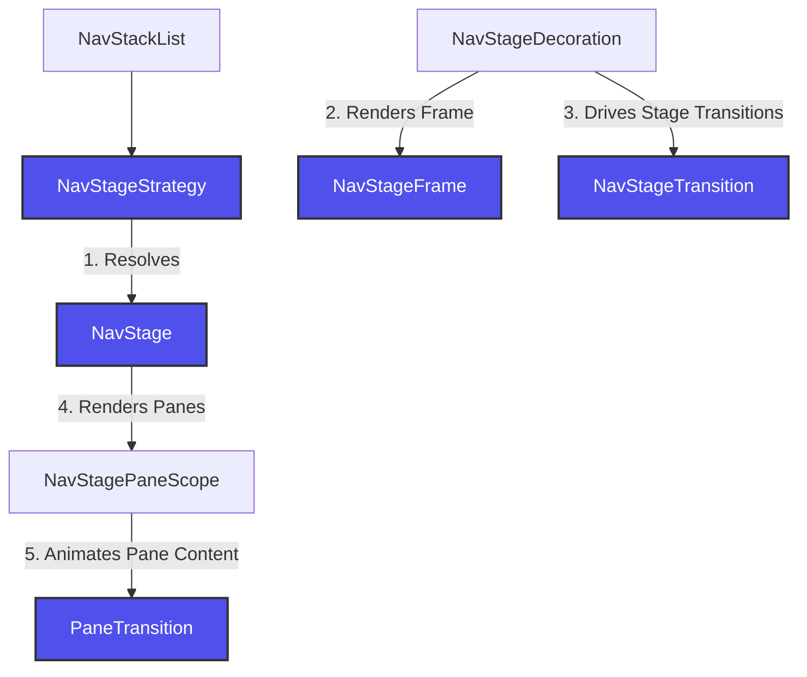
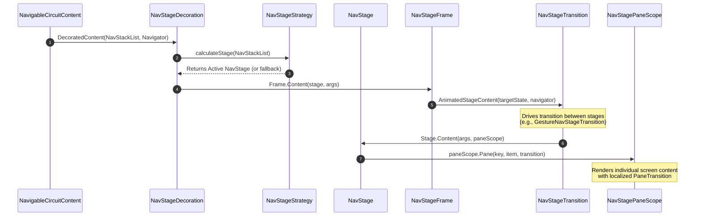

# `nav-stage`

A modular, multi-pane navigation decoration system for the [Circuit](https://github.com/slackhq/circuit) framework. `nav-stage` enables declarative, layout-agnostic split-screen navigation (such as List-Detail split screens on tablets or foldables) that adapt dynamically to window metrics and device postures.

---

## 🏛 Architectural Review & Core Design

Traditional navigation frameworks suffer from the **"split-pane state synchronization problem"**—they force presenters to coordinate layout changes or manage complex nested routers when the device shifts from single-pane (portrait phone) to multi-pane (tablet/foldable). 

`nav-stage` resolves this by decoupling **navigation hierarchy** from **physical stage layout**. Your presenters emit pure, flat UI states, while `nav-stage` determines *how* and *where* to render them using layout strategies.

### Separation of Concerns

`nav-stage` achieves absolute separation of concerns by isolating different facets of multi-pane navigation into five dedicated primitives:



1. **`NavStageStrategy`**: Evaluates the flat navigation stack (e.g., active screen, back stack history) and window metrics to determine the active layout stage.
2. **`NavStage`**: Holds layout structural logic (e.g., `SinglePaneNavStage`, `ListDetailNavStage`). Renders the physical layout container and mapping stack items to individual panes.
3. **`NavStageFrame`**: Applies styling decoration around the entire active stage (clipping, borders, shadows, background sheets).
4. **`NavStageTransition`**: Handles animations when transitioning *between stage layouts* (e.g., sliding or crossfading from single-pane to dual-pane when folding a device).
5. **`PaneTransition`**: Handles transitions *within an individual pane* when a new screen is pushed or popped inside a container (e.g., sliding a detail view in, while keeping the list view stable).

---

## 🔄 Runtime Flow Sequence

Below is the runtime lifecycle of how a stack push/pop propagates through the layout decoration layers:



---

## 🆚 `nav-stage` vs. Traditional Nested Navigation

| Aspect | Traditional Nested Routers | `nav-stage` Declarative Pipeline |
| :--- | :--- | :--- |
| **Presenter Complexity** | High. Presenters must know about screen density, folding states, and coordinate nested sub-navigator instances. | **Zero**. Presenters focus 100% on business logic and screen state, completely oblivious to screen density or layout. |
| **State Synchronization** | Manual & Error-Prone. Deep-linking to a detail pane when no list is selected requires custom state machine overrides. | **Automatic**. Driven by a pure function of the flat navigation stack (`NavStackList`). |
| **Dynamic Refolding** | Destroys/re-creates screens or triggers complex transition code to reconcile two separate routing trees. | **Stateless Reconciliation**. Re-evaluates strategies and shifts stages instantly; screens are retained seamlessly. |

---

## ⚡️ DX (Developer Experience) Best Practices

### 1. Stateless Allocation (`SinglePaneNavStage`)
To avoid slot-table allocations during rapid recomposition, `SinglePaneNavStage` is designed as a stateless singleton. 
- Access the shared stateless instance using `SinglePaneNavStage.get()`.
- To maintain backwards compatibility, the module exposes a top-level factory function `SinglePaneNavStage()` which maps directly to the singleton instance under the hood:
  ```kotlin
  val stage = SinglePaneNavStage() // Stateless mapping, zero-allocation
  ```

### 2. Explicit Parameter Flow (No Magic Contexts)
`nav-stage` enforces compile-time safety and transparency by **explicitly passing** the active `Navigator` parameter down through transition scopes (such as `AnimatedStageContent`) rather than storing mutable state or relying on implicit `CompositionLocal` side-effects.

---

## 🚀 Getting Started

### 1. Define Split-Screen Strategy
Define when your layout should split into dual-panes (list & detail) by providing a predicate and pane-specific transitions:

```kotlin
val listDetailStrategy = ListDetailNavStageStrategy(
  isListPane = { it is ListScreen },
  listTransition = PaneTransition.None, // Keep list stable
  detailTransition = PaneTransition.Default // Slide+fade the detail pane
)
```

### 2. Configure `NavStageDecoration`
Provide the strategies to `NavStageDecoration` and set it as your navigation decorator in Circuit. Transitions like `GestureNavStageTransition` receive the explicit navigator parameter dynamically, keeping constructor scopes parameter-free and clean:

```kotlin
val decoration = NavStageDecoration(
  strategies = listOf(listDetailStrategy),
  stageTransition = GestureNavStageTransition()
)

CircuitCompositionLocals(circuit) {
  NavigableCircuitContent(
    navigator = navigator,
    backStack = backStack,
    decoration = decoration
  )
}
```

---

## ✨ Shared Elements & Scope Resolution

`nav-stage` is fully integrated with standard Compose shared element transitions across Overlay, Stage, and individual Pane boundaries.

### Dynamic Stage Scope Resolution
To easily resolve the active `AnimatedVisibilityScope` in child screens (whether they are transitioning between screens inside a single pane or moving between stages), use the `findActiveStageScope()` extension on `SharedElementTransitionScope`:

```kotlin
val sharedScope = SharedElementTransitionScope {
  val activeScope = findActiveStageScope()
  if (activeScope != null) {
    Modifier.sharedElement(
      rememberSharedContentState(key = "hero-item"),
      animatedVisibilityScope = activeScope
    )
  } else Modifier
}
```
