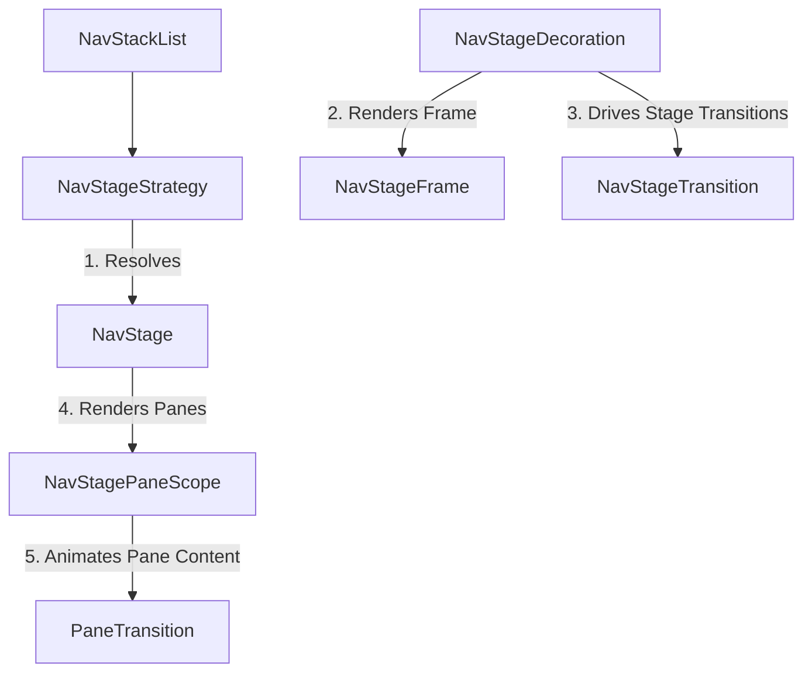

# nav-stage

A modular, multi-pane navigation decoration system for the [Circuit](https://github.com/slackhq/circuit) framework. `nav-stage` enables declarative, layout-agnostic split-screen navigation (such as List-Detail split screens on tablets or foldables) that adapt dynamically to window metrics and device postures.

---

## Overview

`nav-stage` achieves absolute separation of concerns by isolating different facets of multi-pane navigation into dedicated components:



1. **`NavStageStrategy`**: Determines when to activate a specific layout stage based on the navigation stack and window size classes.
2. **`NavStage`**: Renders the physical layout structure (e.g. single-pane, 40/60 horizontal split) and defines which stack items are rendered.
3. **`NavStageFrame`**: Applies styling decorations around the entire stage layout (clipping, borders, elevation).
4. **`NavStageTransition`**: Animates the boundaries when transitioning *between* stages (e.g. single-pane to dual-pane).
5. **`PaneTransition`**: Animates changes *within* an individual pane when a screen is pushed or popped.

---

## Getting Started

### 1. Define split-screen rules with a Strategy
Create a `ListDetailNavStageStrategy` to define when your app should transition into a split-pane layout:

```kotlin
val listDetailStrategy = ListDetailNavStageStrategy(
  isListPane = { it is ListPane },
  isDetailPane = { it is DetailPane },
  listTransition = { PaneTransition.None },
  detailTransition = { PaneTransition.Default }
)
```

### 2. Configure `NavStageDecoration`
Provide the strategies to `NavStageDecoration` and set it as your navigation decorator in Circuit:

```kotlin
val decoration = NavStageDecoration(
  strategies = listOf(listDetailStrategy),
  stageTransition = GestureNavStageTransition(onBack = { navigator.pop() })
)

CircuitCompositionLocals(circuit) {
  NavigableCircuitContent(
    navigator = navigator,
    backStack = backStack,
    decoration = decoration
  )
}
```

---

## Shared Elements

`nav-stage` is fully integrated with standard Compose shared element transitions acrossOverlay, Stage, and individual Pane boundaries.

### Dynamic Scope Resolution
To easily resolve the correct `AnimatedVisibilityScope` in child screens (whether they are transitioning between screens inside a single pane or moving between stages), use the `findActiveStageScope()` helper:

```kotlin
val sharedScope = SharedElementTransitionScope {
  val activeScope = findActiveStageScope()
  if (activeScope != null) {
    Modifier.sharedElement(
      rememberSharedContentState(key = "item-key"),
      animatedVisibilityScope = activeScope
    )
  } else Modifier
}
```
