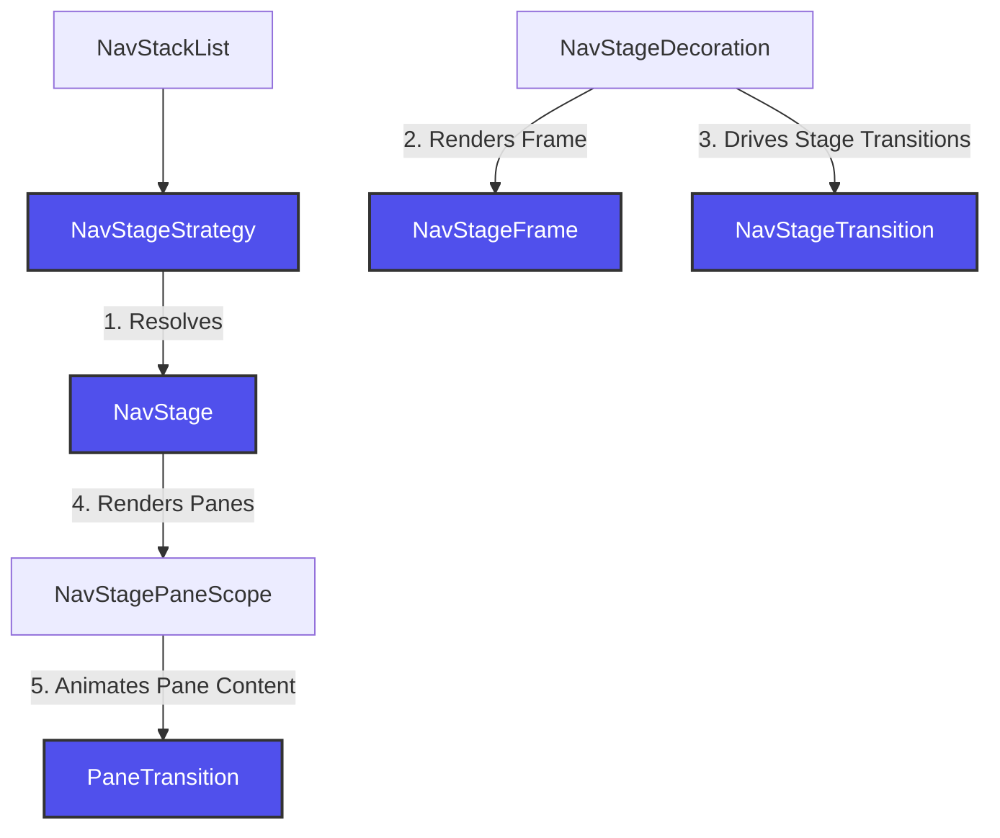
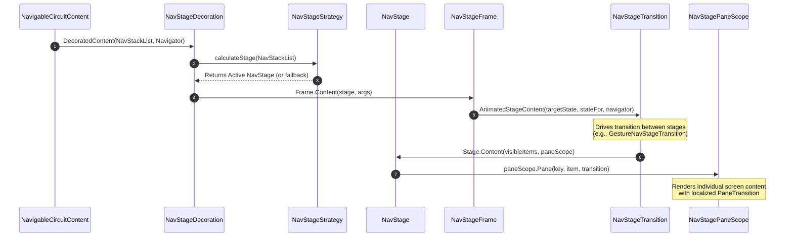

# `nav-stage`

A modular, layout-agnostic navigation decoration system for Circuit.

See the [user guide](https://slackhq.github.io/circuit/circuitx/nav-stage/) for usage, customization, and building your own stages.

---

## Overview

`nav-stage` decouples **navigation hierarchy** from **physical stage layout**. Your presenters emit pure, flat UI states, while `nav-stage` determines *how* and *where* to render them using layout strategies.



```mermaid
graph TD
    classDef main fill:#5050EC,stroke:#333,stroke-width:2px,color:#fff;
    classDef detail fill:#F5F5FA,stroke:#333,stroke-width:1px,color:#000;

    NavStackList --> NavStageStrategy
    NavStageStrategy -->|1. Resolves| NavStage
    NavStageDecoration -->|2. Renders Frame| NavStageFrame
    NavStageDecoration -->|3. Drives Stage Transitions| NavStageTransition
    NavStage -->|4. Renders Panes| NavStagePaneScope
    NavStagePaneScope -->|5. Animates Pane Content| PaneTransition

    class NavStageStrategy,NavStage,NavStageFrame,NavStageTransition,PaneTransition main;
```

1. **`NavStageStrategy`**: Evaluates the flat navigation stack (e.g., active screen, back stack history) and the space the decoration was given to determine the active layout stage.
2. **`NavStage`**: Holds layout structural logic (e.g., `SinglePaneNavStage`, `ListDetailNavStage`). Renders the physical layout container, maps stack items to individual panes, and decides what navigation from each pane does to the stack through its `navigationPolicy`.
3. **`NavStageFrame`**: Applies styling decoration around the entire active stage (clipping, borders, shadows, background sheets).
4. **`NavStageTransition`**: Handles animations when transitioning *between stage layouts* (e.g., sliding or crossfading from single-pane to dual-pane when folding a device).
5. **`PaneTransition`**: Handles transitions *within an individual pane* when a new screen is pushed or popped inside a container (e.g., sliding a detail view in, while keeping the list view stable).

---

## Runtime Flow Sequence

Below is the runtime lifecycle of how a stack push/pop propagates through the layout decoration layers:


```mermaid
sequenceDiagram
    autonumber
    participant App as NavigableCircuitContent
    participant Deco as NavStageDecoration
    participant Strat as NavStageStrategy
    participant Stage as NavStage
    participant Frame as NavStageFrame
    participant Trans as NavStageTransition
    participant Pane as NavStagePaneScope

    App->>Deco: DecoratedContent(NavStackList, Navigator)
    Deco->>Strat: calculateStage(NavStackList)
    Strat-->>Deco: Returns Active NavStage (or fallback)
    Deco->>Frame: Frame.Content(stage, args)
    Frame->>Trans: AnimatedStageContent(targetState, stateFor, navigator)
    Note over Trans: Drives transition between stages<br/>(e.g., GestureNavStageTransition)
    Trans->>Stage: Stage.Content(visibleItems, paneScope)
    Stage->>Pane: paneScope.Pane(key, item, transition)
    Note over Pane: Renders individual screen content<br/>with localized PaneTransition
```


---

## Getting Started

### 1. Define Split-Screen Strategy
Define when your layout should split into dual-panes (list & detail). The list and detail predicates are required, and the rest are optional:

```kotlin
val listDetailStrategy = ListDetailNavStageStrategy(
  isListPane = { it is ListScreen },
  isDetailPane = { it is DetailScreen },
  listTransition = { PaneTransition.None }, // Keep list stable
  detailTransition = { PaneTransition.Default }, // Slide+fade the detail pane
  listGoTo = ListDetailNavStage.ListGoTo.ReplaceDetail, // Opening from the list swaps the detail
)
```

It splits once the decoration is at least 600dp wide. Pass `isMultiPane` to pick your own breakpoint.

### 2. Configure `NavStageDecoration`
Provide the strategies to `NavStageDecoration` and set it as your navigation decorator in Circuit. Remember it so it isn't rebuilt every recomposition. `SharedElementTransitionLayout` is optional, but without it panes can't animate between layouts:

```kotlin
@OptIn(ExperimentalNavStageApi::class)
val decoration = remember {
  NavStageDecoration(
    strategies = listOf(listDetailStrategy),
    stageTransition = GestureNavStageTransition()
  )
}

CircuitCompositionLocals(circuit) {
  SharedElementTransitionLayout {
    val navStack = rememberSaveableNavStack(HomeScreen)
    val navigator = rememberCircuitNavigator(navStack)
    NavigableCircuitContent(
      navigator = navigator,
      navStack = navStack,
      decoration = decoration
    )
  }
}
```

---

## Shared Elements

`nav-stage` is fully integrated with standard Compose shared element transitions across Overlay, Stage, and individual Pane boundaries.

### Dynamic Stage Scope Resolution
To easily resolve the active `AnimatedVisibilityScope` in child screens (whether they are transitioning between screens inside a single pane or moving between stages), use the `findActiveStageScope()` extension on `SharedElementTransitionScope`:

```kotlin
SharedElementTransitionScope {
  val activeScope = findActiveStageScope()
  val heroModifier =
    if (activeScope != null) {
      Modifier.sharedElement(
        rememberSharedContentState(key = "hero-item"),
        animatedVisibilityScope = activeScope
      )
    } else Modifier
  Image(painter, contentDescription = null, modifier = heroModifier)
}
```

### Migrating from `AnimatedNavDecoration`
Under `NavStageDecoration` the `Navigation` scope belongs to the stage transition, so it only animates when the stage layout changes or a back gesture runs, not when a screen is pushed inside a pane. Every built-in `NavStageTransition` still provides it, so `requireAnimatedScope(Navigation)` won't throw, but shared elements keyed to it stop following in-pane navigation. Switch those to `findActiveStageScope()`, or to `PaneAnimatedScope` if they only care about in-pane navigation.

---

## Navigation Policy

Each record shown in a pane gets its own `Navigator`. Its calls go through the stage's `NavStageNavigationPolicy` with a `NavStagePaneSource` saying which stage and pane the call came from and how deep that record is in the stack. System back and `GestureNavStageTransition` pop through it too.

```kotlin
override val navigationPolicy =
  object : NavStageNavigationPolicy {
    override fun pop(source: NavStagePaneSource, result: PopResult?, navigator: Navigator): Screen? {
      repeat(source.depth) { navigator.pop() }
      return navigator.pop(result)
    }
  }
```

The default is `NavStageNavigationPolicy.Passthrough`. `ListDetailNavStage` pops the detail along with the list, and follows `listGoTo` when the list navigates.

---

## Pane Window Info

The decoration and each pane provide `LocalPaneWindowInfo` with the space they're laid out in. Use it for breakpoints that should follow a screen's pane rather than the whole window:

```kotlin
val compact = currentPaneWindowDpSize().width < 600.dp
```

`currentPaneWindowSize()` and `currentPaneWindowDpSize()` fall back to `LocalWindowInfo` outside a nav stage.
