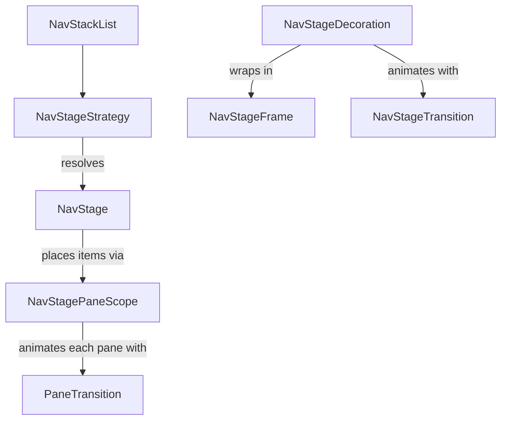

Nav Stage
=========

!!! warning "Experimental"
    Everything here is annotated `@ExperimentalNavStageApi` and may change between releases.

`circuitx-nav-stage` lets one navigation stack drive adaptive layouts. Presenters keep calling `goTo` and `pop` on a flat stack, and a `NavDecoration` decides how many of those records are on screen and where. On a phone a list and its detail stack up like normal screens. Unfold the device and the same stack renders side by side, with no presenter changes.

```kotlin
dependencies {
  implementation("com.slack.circuit:circuitx-nav-stage:<version>")
}
```

## Demo

<video width="600" controls="true" autoplay="true" loop="true" src="../../videos/nav-stage-list-detail.mp4"></video>

The `bottom-navigation` sample wires this up in `ContentScaffold.kt` and `ListDetailScreens.kt`. Run it on a foldable, tablet, or a resizable desktop window and open the list-detail tab.

## Features

- **Adaptive layouts from one stack.** Strategies pick a stage per frame, so folding, rotating, or resizing re-lays out the current stack without touching navigation.
- **List-detail out of the box.** Tell `ListDetailNavStageStrategy` which screens are lists and which are details, and they split once the space the decoration is given is at least 600dp wide.
- **Pluggable layouts.** Write your own `NavStage` for any arrangement: supporting panes, three columns, whatever.
- **Per-pane animation.** Each pane has its own `PaneTransition`, so the detail can slide while the list stays still.
- **Stage transitions.** Animate layout changes with `NavStageTransition`, including shared bounds that move panes between layouts.
- **Predictive back.** `GestureNavStageTransition` previews the popped stack under your finger. Within a list-detail stage only the detail moves.
- **Shared elements.** Works with Circuit's `SharedElementTransitionLayout` across panes, stages, and overlays.
- **State safety.** Every record is composed exactly once, even mid-animation, so saved state and retained presenters behave like they do with the default decoration. One difference: every visible pane is active, not just the top record. See [Things to know](#things-to-know).

## How it fits together



| Piece                | Job                                                                                      | Built in                                                   |
|----------------------|------------------------------------------------------------------------------------------|------------------------------------------------------------|
| `NavStageStrategy`   | Looks at the stack and available space, returns a `NavStage` or `null` to pass.          | `ListDetailNavStageStrategy`                               |
| `NavStage`           | Lays out the stage and puts stack items into panes.                                      | `SinglePaneNavStage()`, `ListDetailNavStage`               |
| `NavStagePaneScope`  | Handed to `NavStage.Content`. `Pane(key, item)` renders a record.                        | Provided by the decoration                                 |
| `PaneTransition`     | Animates the item inside one pane when it changes.                                       | `Default`, `Crossfade`, `None`                             |
| `NavStageTransition` | Animates between stage layouts and handles back gestures.                                | `None`, `Crossfade`, `GestureNavStageTransition`           |
| `NavStageFrame`      | Decorates around the whole stage: background, padding, clipping.                         | `None`                                                     |

Strategies run in order and the first non-null stage wins. If none match, `SinglePaneNavStage()` renders the active record alone with `PaneTransition.Default`. That's the same motion as Circuit's default decorator, but a custom `AnimatedNavDecorator.Factory` or `AnimatedScreenTransform` set on `Circuit.Builder` isn't applied.

## Quick start

Given a list and a detail screen:

```kotlin
@Parcelize data object InboxScreen : Screen

@Parcelize data class EmailScreen(val id: String) : Screen
```

Hand a `NavStageDecoration` to `NavigableCircuitContent`. Remember it so it isn't rebuilt every recomposition.

```kotlin
@OptIn(ExperimentalNavStageApi::class)
@Composable
fun App(circuit: Circuit) {
  val decoration = remember {
    NavStageDecoration(
      strategies =
        listOf(
          ListDetailNavStageStrategy(
            isListPane = { it is InboxScreen },
            isDetailPane = { it is EmailScreen },
          )
        ),
      stageTransition = GestureNavStageTransition(),
    )
  }
  CircuitCompositionLocals(circuit) {
    SharedElementTransitionLayout {
      val navStack = rememberSaveableNavStack(InboxScreen)
      val navigator = rememberCircuitNavigator(navStack)
      NavigableCircuitContent(navigator = navigator, navStack = navStack, decoration = decoration)
    }
  }
}
```

That's it. When the active screen is a detail, a list is somewhere behind it, and the space the decoration is given is at least 600dp wide, you get a 40/60 split. Otherwise it's single pane.

`SharedElementTransitionLayout` is optional, but without it panes can't animate between layouts and just swap.

## Customizing the built-ins

### List-detail

`isListPane` and `isDetailPane` are required. Everything else can be overridden:

```kotlin
ListDetailNavStageStrategy(
  isListPane = { it is InboxScreen || it is SearchScreen },
  isDetailPane = { it is EmailScreen },
  // Your own breakpoint. Defaults to ListDetailNavStageStrategy.DefaultIsMultiPane().
  isMultiPane = { currentPaneWindowDpSize().width > 840.dp },
  // Per-screen pane animations.
  listTransition = { PaneTransition.None },
  detailTransition = { screen ->
    if (screen is ComposeScreen) PaneTransition.Crossfade else PaneTransition.Default
  },
  // What goTo from the list pane does to the detail. ReplaceDetail is the default.
  listGoTo = ListDetailNavStage.ListGoTo.Push,
)
```

`isMultiPane` is composable, so it can read window size classes, posture, or a user setting. `DefaultIsMultiPane()` reads `currentPaneWindowDpSize()`, the space the decoration was given, so a decoration inside a nav rail or a pane picks its layout from its own width. See [Pane window info](#pane-window-info).

Keep the lambdas stable (top level, or remembered). The strategy remembers its stage keyed on them, so a fresh lambda each recomposition rebuilds the stage.

### Stage transitions

```kotlin
NavStageDecoration(strategies, stageTransition = NavStageTransition.Crossfade)
```

- `None` swaps layouts instantly. This is the default.
- `Crossfade` fades between layouts while shared bounds move panes into place.
- `GestureNavStageTransition()` adds predictive back on top. During the gesture the popped stack renders behind the current one and the leaving content scales and shifts with your finger. If the popped stack keeps the same layout, only the panes whose item changes move, so the list stays put while the detail goes. Completing the gesture pops through the stage's [navigation policy](#navigation-policy).

`GestureNavStageTransition` drives the gesture itself instead of going through `AnimatedNavDecoration`, so the same motion applies on any platform that delivers back gestures.

### Pane transitions

`PaneTransition.Default` uses the same forward and back motion as Circuit's default decorator and fades on a root reset. `Crossfade` fades. `None` swaps.

Each pane's animation state belongs to its pane `key`. Changing the key starts the pane fresh instead of animating from the old item.

### Frames

A frame wraps the whole stage. The sample uses one to give the stage a background and gutter:

```kotlin
object GutterFrame : NavStageFrame {
  @Composable
  override fun <T : NavArgument> Content(
    modifier: Modifier,
    stage: NavStage<T>,
    args: NavStackList<T>,
    stageContent: @Composable () -> Unit,
  ) {
    Box(modifier.background(MaterialTheme.colorScheme.surfaceContainer).padding(8.dp)) {
      stageContent()
    }
  }
}
```

The frame gets the resolved `stage`, so it can decorate list-detail differently from single pane.

## Building a custom stage

Say you want a supporting pane: a fixed-width side panel next to whatever opened it.

```kotlin
interface SupportingPane

@OptIn(ExperimentalNavStageApi::class)
class SupportingPaneStage<T : NavArgument> : NavStage<T> {
  override val key: Any = "com.example.supporting-pane"

  override fun visibleItems(args: NavStackList<T>): List<T> {
    val main = args.backwardItems.firstOrNull() ?: return listOf(args.active)
    return listOf(main, args.active)
  }

  @Composable
  override fun Content(items: List<T>, paneScope: NavStagePaneScope<T>, modifier: Modifier) {
    if (items.size == 1) {
      paneScope.Pane(key = "supporting", item = items.single(), modifier = modifier.fillMaxSize())
      return
    }
    val (main, supporting) = items
    Row(modifier.fillMaxSize()) {
      paneScope.Pane(key = "main", item = main, modifier = Modifier.weight(1f))
      paneScope.Pane(
        key = "supporting",
        item = supporting,
        modifier = Modifier.width(360.dp),
        transition = PaneTransition.Crossfade,
      )
    }
  }
}
```

Then a strategy to decide when to use it:

```kotlin
@OptIn(ExperimentalNavStageApi::class)
object SupportingPaneStrategy : NavStageStrategy {
  @Composable
  override fun <T : NavArgument> calculateStage(args: NavStackList<T>): NavStage<T>? {
    if (!ListDetailNavStageStrategy.DefaultIsMultiPane()) return null
    if (args.active.screen !is SupportingPane) return null
    if (args.backwardItems.none()) return null
    return remember { SupportingPaneStage() }
  }
}

NavStageDecoration(
  strategies =
    listOf(
      SupportingPaneStrategy,
      ListDetailNavStageStrategy(isListPane = { it is InboxScreen }, isDetailPane = { it is EmailScreen }),
    ),
  stageTransition = GestureNavStageTransition(),
)
```

### Rules for stages

These are what keep every record composed once and transitions correct:

- **`visibleItems` must be pure.** Return the items to show, in pane order. The decoration calls it once per stack and hands the result to `Content`, and transitions use it to work out which records are shared between layouts.
- **Place exactly the items you're given.** Put each item from `items` in one `Pane`. Placing an item that isn't in `items` fails fast.
- **No item twice.** Two panes can't show the same record. The decoration fails fast if `visibleItems` repeats a key.
- **Unique pane keys.** The pane `key` identifies the slot ("list", "detail"), not the item. Keep it stable as the item in it changes, so its `PaneTransition` can animate. A new key starts the pane fresh.
- **Namespace the stage `key`.** Stages with the same key are treated as the same layout and won't transition. Something like `"com.example.supporting-pane"` avoids clashes.
- **Remember the stage in the strategy.** A new instance each pass works, but a stable one is cheaper.
- **Handle stacks you didn't expect.** During a back gesture or a layout change, a stage can render an older stack than the one it was picked for. Fall back gracefully, like the single-item branch above, instead of throwing.
- **Keep strategies cheap.** Every strategy runs on every pass and possibly more than once a frame, for the current stack and the one being animated from.
- **Fill the pane.** Give each `Pane` a definite size (`weight`, `width`, `fillMaxSize`). Screen UIs should fill what they're given and draw an opaque background, since panes can overlap during gestures.

## Custom transitions

### Pane transition

A pane transition gets the incoming item and the navigation direction. `content` takes the `AnimatedVisibilityScope` animating each item as its receiver, so call it from inside one, like `AnimatedContent`'s content lambda. The pane uses that scope to provide `PaneAnimatedScope` and to tell the entering item from the leaving ones:

```kotlin
@OptIn(ExperimentalNavStageApi::class)
object VerticalSlide : PaneTransition {
  @Composable
  override fun <T : NavArgument> AnimatedPaneContent(
    targetItem: T,
    paneKey: Any,
    navEvent: AnimatedNavEvent,
    modifier: Modifier,
    content: @Composable AnimatedVisibilityScope.(T) -> Unit,
  ) {
    AnimatedContent(
      targetState = targetItem,
      contentKey = { it.key },
      modifier = modifier,
      transitionSpec = {
        val down = navEvent == AnimatedNavEvent.Pop || navEvent == AnimatedNavEvent.Backward
        slideInVertically { if (down) -it else it } togetherWith
          slideOutVertically { if (down) it else -it }
      },
    ) { item ->
      content(item)
    }
  }
}
```

Always call `content` with the slot's own `item`, not `targetItem`, and once per item. Only the entering slot composes the target's record, so the others show an empty placeholder while they leave.

### Stage transition

A stage transition wraps whole layouts. Key the animation on `stageKey` so only layout changes animate, and provide the `Navigation` scope so panes can use shared bounds:

```kotlin
@OptIn(ExperimentalNavStageApi::class, ExperimentalSharedTransitionApi::class)
object SlideStages : NavStageTransition {
  @Composable
  override fun <T : NavArgument> AnimatedStageContent(
    targetState: NavStageTransitionState<T>,
    stateFor: @Composable (NavStackList<T>) -> NavStageTransitionState<T>,
    navigator: Navigator,
    content: @Composable (NavStageTransitionState<T>) -> Unit,
  ) {
    AnimatedContent(
      targetState = targetState,
      contentKey = { it.stageKey },
      transitionSpec = { slideInHorizontally { it } togetherWith slideOutHorizontally { -it } },
    ) { state ->
      ProvideAnimatedTransitionScope(Navigation, this@AnimatedContent) { content(state) }
    }
  }
}
```

If you need to render a stack other than the target, like a back preview, build its state with `stateFor(stack)`. It resolves the stage that stack actually needs.

States are compared by identity. Pass the `targetState` instance you were given to the slot showing it, and to only one slot: that's where the target's records compose, and every other slot gets placeholders for them. Pop through the `navigator` you're given rather than the host's, so back goes through the stage's [navigation policy](#navigation-policy).

## Shared elements

Three scopes are in play:

- `PaneAnimatedScope` follows navigation inside a single pane.
- `Navigation` follows stage layout changes and back gestures.
- `Overlay` follows overlays, as usual.

Most UI wants whichever one is moving, which is what `findActiveStageScope()` returns:

```kotlin
SharedElementTransitionScope {
  val scope = findActiveStageScope()
  Image(
    painter = avatar,
    contentDescription = null,
    modifier =
      if (scope != null) {
        Modifier.sharedElement(rememberSharedContentState("avatar-$id"), scope)
      } else {
        Modifier
      },
  )
}
```

## Navigation policy

Each record shown in a pane gets its own `Navigator`. Its `goTo`, `pop`, `resetRoot`, `forward`, and `backward` calls go to the stage's `navigationPolicy` along with a `NavStagePaneSource`, so the policy knows which pane the call came from and how deep in the stack that record is. `peek` calls aren't routed and always see the real stack. System back and `GestureNavStageTransition` go through `pop` with the top pane as the source.

```kotlin
override val navigationPolicy =
  object : NavStageNavigationPolicy {
    override fun pop(source: NavStagePaneSource, result: PopResult?, navigator: Navigator): Screen? {
      // Pop everything above the calling pane first.
      repeat(source.depth) { navigator.pop() }
      return navigator.pop(result)
    }
  }
```

Every method defaults to passing the call straight through, and `NavStage.navigationPolicy` defaults to `NavStageNavigationPolicy.Passthrough`. `ListDetailNavStage` treats the list as the owner of the detail beside it: `pop` from the list pops the detail too, and `goTo` from the list follows `listGoTo`. Calls from the detail pass through.

Answering navigators go through the same per record navigator. A popped result goes to the record that launched the screen, even when the policy leaves a different record on top.

## Pane window info

`LocalWindowInfo` is the whole window. Panes and the decoration itself also provide `LocalPaneWindowInfo` with the space they were given. Read it through the helpers, which fall back to `LocalWindowInfo` outside a nav stage:

```kotlin
val width = currentPaneWindowDpSize().width
val compact = width < 600.dp
```

- `currentPaneWindowSize()` is the size in pixels, `currentPaneWindowDpSize()` in dp.
- Strategies see the decoration's size. Screen UI sees its pane's.
- Sizes come from the constraints the space is measured with, so they're current for the frame being laid out. An unbounded dimension reports the enclosing pane's size, or the window's.
- During a layout change, shared bounds resize the pane, so the reported size animates with it.

## Recipes

### Highlight the selected list item

The list's presenter can read the visible detail from the back stack. `peekBackStack` is snapshot backed, so this recomposes on navigation:

```kotlin
val selectedId = (navigator.peekBackStack().firstOrNull() as? EmailScreen)?.id
```

### Stack details instead of swapping them

In a split, `goTo` from the list replaces the current detail by default, so back goes straight to the list. To keep every detail you opened in the back stack, pass `listGoTo = ListDetailNavStage.ListGoTo.Push`. In single pane the list is the top when it navigates, so phones always stack.

## Things to know

- **Each record gets its own navigator.** Calls from a pane go through the stage's [navigation policy](#navigation-policy). The instance stays the same while the record is in the stack, wherever it's shown, so don't compare it against the host navigator.
- **More than one record is active.** `LocalRecordLifecycle.current.isActive` is true for the current record of every visible pane, so a list and its detail are both active in a split. Anything that treats "active" as "top of the stack", like screen view analytics, focus requests, or one shot effects, runs for each pane.
- **Content composes during layout.** The decoration and each pane are `SubcomposeLayout`s so they can provide their size before their content composes. Like `BoxWithConstraints`, they don't support intrinsic measurements, so don't measure the decoration or a pane with `IntrinsicSize`.
- **A record moving between panes leaves a gap.** When the list takes over the detail's record, that record moves to the list pane straight away and the detail's exit animation shows an empty placeholder.

## Migrating from `AnimatedNavDecoration`

`NavStageDecoration` is a sibling of `AnimatedNavDecoration`, not an extension:

- `Circuit.Builder.setAnimatedNavDecoratorFactory` and `addAnimatedScreenTransform` aren't applied to stage content. Use a `PaneTransition` instead.
- More than one record can be active at once. Check anything that reads `LocalRecordLifecycle` and assumes it means top of the stack.
- The `Navigation` scope only animates for layout changes and back gestures, not for a push inside a pane. Shared elements keyed to it should switch to `findActiveStageScope()`, or `PaneAnimatedScope` if they only care about in-pane navigation. Every built-in transition still provides `Navigation`, so `requireAnimatedScope(Navigation)` won't throw.
