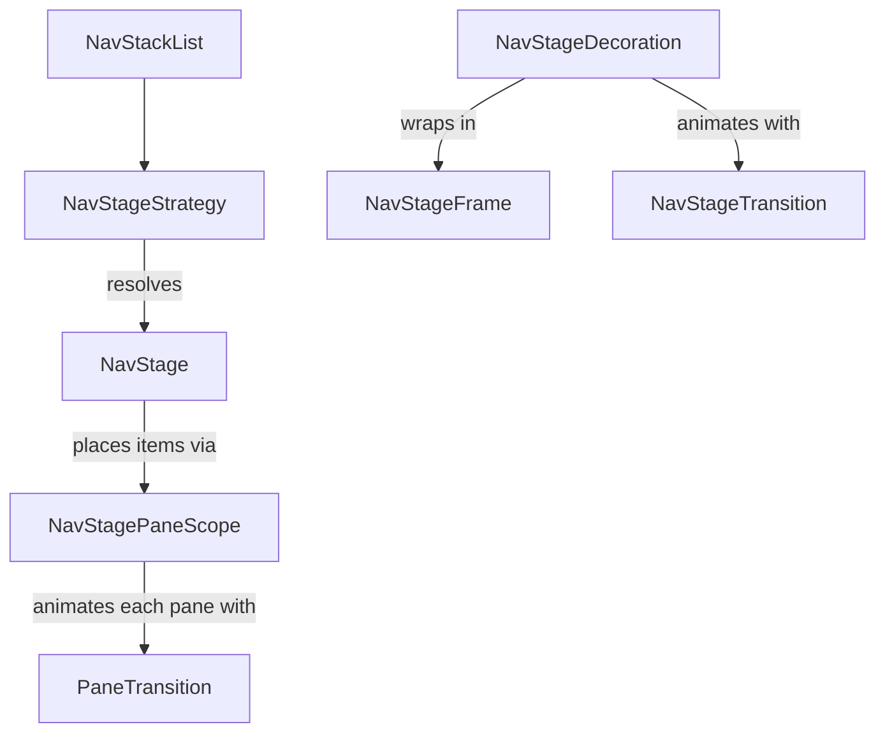

Nav Stage
=========

!!! warning "Experimental"
    Everything here is annotated `@ExperimentalNavStageApi` and may change between releases.

`circuitx-nav-stage` lets one navigation stack drive adaptive layouts. Presenters keep calling `goTo` and `pop` on a flat stack, and a `NavDecoration` decides how many of those records are on screen and where. On a phone a list and its detail stack up like normal screens. Unfold the device and the same stack renders side by side, with no presenter changes.

```kotlin
dependencies {
  implementation("com.slack.circuit:circuitx-nav-stage:<version>")
}
```

## Demo

<video width="600" controls="true" autoplay="true" loop="true" src="../../videos/nav-stage-list-detail.mp4"></video>

The `bottom-navigation` sample wires this up in `ContentScaffold.kt` and `ListDetailScreens.kt`. Run it on a foldable, tablet, or a resizable desktop window and open the list-detail tab.

## Features

- **Adaptive layouts from one stack.** Strategies pick a stage per frame, so folding, rotating, or resizing re-lays out the current stack without touching navigation.
- **List-detail out of the box.** Mark screens with `ListPane` and `DetailPane` and they split once the window is medium width or wider.
- **Pluggable layouts.** Write your own `NavStage` for any arrangement: supporting panes, three columns, whatever.
- **Per-pane animation.** Each pane has its own `PaneTransition`, so the detail can slide while the list stays still.
- **Stage transitions.** Animate layout changes with `NavStageTransition`, including shared bounds that move panes between layouts.
- **Predictive back.** `GestureNavStageTransition` previews the popped stack under your finger. Within a list-detail stage only the detail moves.
- **Shared elements.** Works with Circuit's `SharedElementTransitionLayout` across panes, stages, and overlays.
- **State safety.** Every record is composed exactly once, even mid-animation, so saved state and retained presenters behave like they do with the default decoration.

## How it fits together



| Piece                | Job                                                                                      | Built in                                                   |
|----------------------|------------------------------------------------------------------------------------------|------------------------------------------------------------|
| `NavStageStrategy`   | Looks at the stack and window, returns a `NavStage` or `null` to pass.                   | `ListDetailNavStageStrategy`                               |
| `NavStage`           | Lays out the stage and puts stack items into panes.                                      | `SinglePaneNavStage`, `ListDetailNavStage`                 |
| `NavStagePaneScope`  | Handed to `NavStage.Content`. `Pane(key, item)` renders a record.                        | Provided by the decoration                                 |
| `PaneTransition`     | Animates the item inside one pane when it changes.                                       | `Default`, `Crossfade`, `None`                             |
| `NavStageTransition` | Animates between stage layouts and handles back gestures.                                | `None`, `Crossfade`, `GestureNavStageTransition`           |
| `NavStageFrame`      | Decorates around the whole stage: background, padding, clipping.                         | `None`                                                     |

Strategies run in order and the first non-null stage wins. If none match, `SinglePaneNavStage` renders the active record alone, which looks just like Circuit's default decoration.

## Quick start

Mark your screens:

```kotlin
@Parcelize data object InboxScreen : Screen, ListPane

@Parcelize data class EmailScreen(val id: String) : Screen, DetailPane
```

Hand a `NavStageDecoration` to `NavigableCircuitContent`. Remember it so it isn't rebuilt every recomposition.

```kotlin
@OptIn(ExperimentalNavStageApi::class)
@Composable
fun App(circuit: Circuit) {
  val decoration = remember {
    NavStageDecoration(
      strategies = listOf(ListDetailNavStageStrategy()),
      stageTransition = GestureNavStageTransition(),
    )
  }
  CircuitCompositionLocals(circuit) {
    SharedElementTransitionLayout {
      val navStack = rememberSaveableNavStack(InboxScreen)
      val navigator = rememberCircuitNavigator(navStack)
      NavigableCircuitContent(navigator = navigator, navStack = navStack, decoration = decoration)
    }
  }
}
```

That's it. When the active screen is a `DetailPane`, a `ListPane` is somewhere behind it, and the window is at least medium width, you get a 40/60 split. Otherwise it's single pane.

`SharedElementTransitionLayout` is optional, but without it panes can't animate between layouts and just swap.

## Customizing the built-ins

### List-detail

Every part of `ListDetailNavStageStrategy` can be overridden:

```kotlin
ListDetailNavStageStrategy(
  // Use your own predicates instead of the marker interfaces.
  isListPane = { it is InboxScreen || it is SearchScreen },
  isDetailPane = { it is EmailScreen },
  // Your own breakpoint. Defaults to ListDetailNavStageStrategy.DefaultIsMultiPane().
  isMultiPane = { LocalWindowInfo.current.containerSize.width > 1200 },
  // Per-screen pane animations.
  listTransition = { PaneTransition.None },
  detailTransition = { screen ->
    if (screen is ComposeScreen) PaneTransition.Crossfade else PaneTransition.Default
  },
)
```

`isMultiPane` is composable, so it can read window size classes, posture, or a user setting.

Keep the lambdas stable (top level, or remembered). The strategy remembers its stage keyed on them, so a fresh lambda each recomposition rebuilds the stage.

### Stage transitions

```kotlin
NavStageDecoration(strategies, stageTransition = NavStageTransition.Crossfade)
```

- `None` swaps layouts instantly. This is the default.
- `Crossfade` fades between layouts while shared bounds move panes into place.
- `GestureNavStageTransition(onBack)` adds predictive back on top. During the gesture the popped stack renders behind the current one and the leaving content scales and shifts with your finger. If the popped stack keeps the same layout, only the panes whose item changes move, so the list stays put while the detail goes. Pass `onBack` if you route back through something other than `Navigator.pop`, but it should still pop, since that's what the preview showed.

`GestureNavStageTransition` drives the gesture itself instead of going through `AnimatedNavDecoration`, so the same motion applies on any platform that delivers back gestures.

### Pane transitions

`PaneTransition.Default` slides and fades directionally based on whether the navigation went forward or back. `Crossfade` fades. `None` swaps.

### Frames

A frame wraps the whole stage. The sample uses one to give the stage a background and gutter:

```kotlin
object GutterFrame : NavStageFrame {
  @Composable
  override fun <T : NavArgument> Content(
    modifier: Modifier,
    stage: NavStage<T>,
    args: NavStackList<T>,
    stageContent: @Composable () -> Unit,
  ) {
    Box(modifier.background(MaterialTheme.colorScheme.surfaceContainer).padding(8.dp)) {
      stageContent()
    }
  }
}
```

The frame gets the resolved `stage`, so it can decorate list-detail differently from single pane.

## Building a custom stage

Say you want a supporting pane: a fixed-width side panel next to whatever opened it.

```kotlin
interface SupportingPane

@OptIn(ExperimentalNavStageApi::class)
class SupportingPaneStage<T : NavArgument> : NavStage<T> {
  override val key: Any = "com.example.supporting-pane"

  override fun visibleItems(args: NavStackList<T>): List<T> {
    val main = args.backwardItems.firstOrNull() ?: return listOf(args.active)
    return listOf(main, args.active)
  }

  @Composable
  override fun Content(args: NavStackList<T>, paneScope: NavStagePaneScope<T>, modifier: Modifier) {
    val items = visibleItems(args)
    if (items.size == 1) {
      paneScope.Pane(key = "supporting", item = items.single(), modifier = modifier.fillMaxSize())
      return
    }
    val (main, supporting) = items
    Row(modifier.fillMaxSize()) {
      paneScope.Pane(key = "main", item = main, modifier = Modifier.weight(1f))
      paneScope.Pane(
        key = "supporting",
        item = supporting,
        modifier = Modifier.width(360.dp),
        transition = PaneTransition.Crossfade,
      )
    }
  }
}
```

Then a strategy to decide when to use it:

```kotlin
@OptIn(ExperimentalNavStageApi::class)
object SupportingPaneStrategy : NavStageStrategy {
  @Composable
  override fun <T : NavArgument> calculateStage(args: NavStackList<T>): NavStage<T>? {
    if (!ListDetailNavStageStrategy.DefaultIsMultiPane()) return null
    if (args.active.screen !is SupportingPane) return null
    if (args.backwardItems.none()) return null
    return remember { SupportingPaneStage() }
  }
}

NavStageDecoration(
  strategies = listOf(SupportingPaneStrategy, ListDetailNavStageStrategy()),
  stageTransition = GestureNavStageTransition(),
)
```

### Rules for stages

These are what keep every record composed once and transitions correct:

- **`visibleItems` must be pure and match `Content`.** Return exactly the items `Content` passes to `Pane`, in pane order. Transitions use it to work out which records are shared between layouts.
- **No item twice.** Two panes can't show the same record. The decoration fails fast if `visibleItems` repeats a key.
- **Unique pane keys.** The pane `key` identifies the slot ("list", "detail"), not the item. Keep it stable as the item in it changes, so its `PaneTransition` can animate.
- **Namespace the stage `key`.** Stages with the same key are treated as the same layout and won't transition. Something like `"com.example.supporting-pane"` avoids clashes.
- **Remember the stage in the strategy.** A new instance each pass works, but a stable one is cheaper.
- **Handle stacks you didn't expect.** During a back gesture or a layout change, a stage can render an older stack than the one it was picked for. Fall back gracefully, like the single-item branch above, instead of throwing.
- **Keep strategies cheap.** Every strategy runs on every pass and possibly more than once a frame, for the current stack and the one being animated from.
- **Fill the pane.** Give each `Pane` a definite size (`weight`, `width`, `fillMaxSize`). Screen UIs should fill what they're given and draw an opaque background, since panes can overlap during gestures.

## Custom transitions

### Pane transition

A pane transition gets the incoming item and the navigation direction:

```kotlin
@OptIn(ExperimentalNavStageApi::class)
object VerticalSlide : PaneTransition {
  @Composable
  override fun <T : NavArgument> AnimatedPaneContent(
    targetItem: T,
    paneKey: Any,
    navEvent: AnimatedNavEvent,
    modifier: Modifier,
    content: @Composable (T) -> Unit,
  ) {
    AnimatedContent(
      targetState = targetItem,
      contentKey = { it.key },
      modifier = modifier,
      transitionSpec = {
        val down = navEvent == AnimatedNavEvent.Pop || navEvent == AnimatedNavEvent.Backward
        slideInVertically { if (down) -it else it } togetherWith
          slideOutVertically { if (down) it else -it }
      },
    ) { item ->
      content(item)
    }
  }
}
```

Always call `content` with the slot's own `item`, not `targetItem`. Rendering the target in both slots composes the record twice.

### Stage transition

A stage transition wraps whole layouts. Key the animation on `stageKey` so only layout changes animate, and provide the `Navigation` scope so panes can use shared bounds:

```kotlin
@OptIn(ExperimentalNavStageApi::class, ExperimentalSharedTransitionApi::class)
object SlideStages : NavStageTransition {
  @Composable
  override fun <T : NavArgument> AnimatedStageContent(
    targetState: NavStageTransitionState<T>,
    stateFor: @Composable (NavStackList<T>) -> NavStageTransitionState<T>,
    navigator: Navigator,
    content: @Composable (NavStageTransitionState<T>) -> Unit,
  ) {
    AnimatedContent(
      targetState = targetState,
      contentKey = { it.stageKey },
      transitionSpec = { slideInHorizontally { it } togetherWith slideOutHorizontally { -it } },
    ) { state ->
      ProvideAnimatedTransitionScope(Navigation, this@AnimatedContent) { content(state) }
    }
  }
}
```

If you need to render a stack other than the target, like a back preview, build its state with `stateFor(stack)`. It resolves the stage that stack actually needs.

## Shared elements

Three scopes are in play:

- `Pane` follows navigation inside a single pane.
- `Navigation` follows stage layout changes and back gestures.
- `Overlay` follows overlays, as usual.

Most UI wants whichever one is moving, which is what `findActiveStageScope()` returns:

```kotlin
SharedElementTransitionScope {
  val scope = findActiveStageScope()
  Image(
    painter = avatar,
    contentDescription = null,
    modifier =
      if (scope != null) {
        Modifier.sharedElement(rememberSharedContentState("avatar-$id"), scope)
      } else {
        Modifier
      },
  )
}
```

## Recipes

### Highlight the selected list item

The list's presenter can read the visible detail from the back stack. `peekBackStack` is snapshot backed, so this recomposes on navigation:

```kotlin
val selectedId = (navigator.peekBackStack().firstOrNull() as? EmailScreen)?.id
```

### Swap the detail instead of stacking it

Tapping items in a split list pushes a detail each time, so back walks through every one you opened. If you'd rather back go straight to the list, replace the current detail:

```kotlin
if (navigator.peekBackStack().firstOrNull() is EmailScreen) navigator.pop()
navigator.goTo(EmailScreen(id))
```

This changes single-pane behaviour too, so gate it on your multi-pane check if phones should keep stacking.

## Migrating from `AnimatedNavDecoration`

`NavStageDecoration` is a sibling of `AnimatedNavDecoration`, not an extension:

- `Circuit.Builder.addAnimatedScreenTransform` isn't applied to stage content. Use a `PaneTransition` instead.
- The `Navigation` scope only animates for layout changes and back gestures, not for a push inside a pane. Shared elements keyed to it should switch to `findActiveStageScope()`, or `Pane` if they only care about in-pane navigation. Every built-in transition still provides `Navigation`, so `requireAnimatedScope(Navigation)` won't throw.
