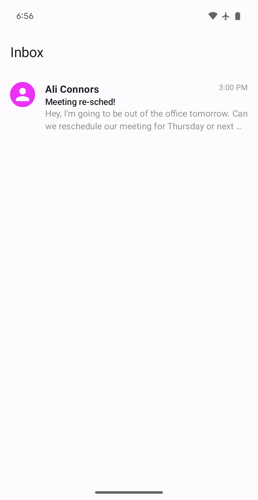
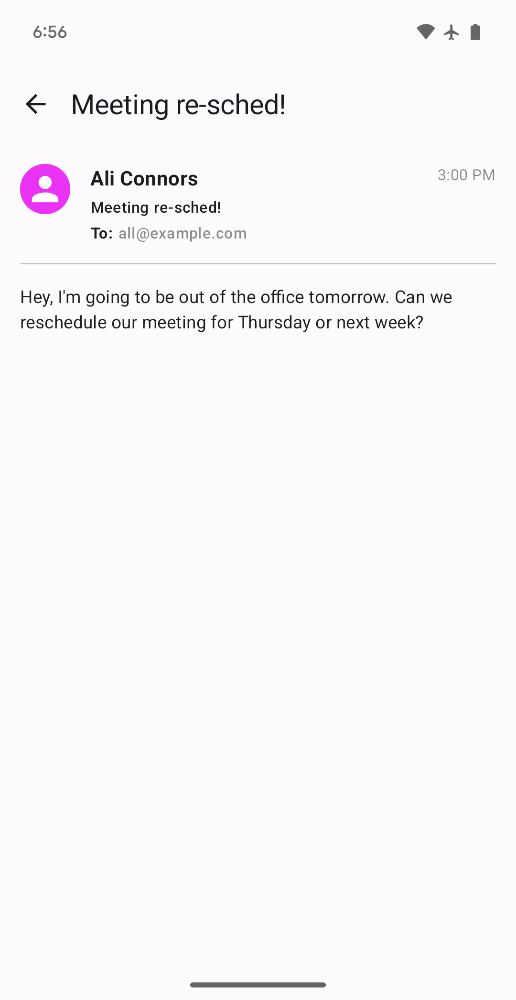

Tutorial
========

This tutorial will help you ramp up to Circuit with a simple email app.

Note this assumes some prior experience with Compose. See these resources for more information:

- (Android) [Get started with Jetpack Compose](https://developer.android.com/jetpack/compose/documentation)
- (Android) [Jetpack Compose Tutorial](https://developer.android.com/jetpack/compose/tutorial)
- (Multiplatform) [Get started with Compose Multiplatform](https://www.jetbrains.com/help/kotlin-multiplatform-dev/compose-multiplatform-getting-started.html)

## Setup

You can do this tutorial in one of two ways:

### 1. Build out of the `tutorial` sample

Clone the circuit repo and work out of the `:samples:tutorial` module. This has all your dependencies set up and ready to go, along with some reusable common code to save you some boilerplate. You can see an implementation of this tutorial there as well.

This can be run on Android or Desktop.
- The Desktop entry point is `main.kt`. To run the main function, you can run `./gradlew :samples:tutorial:run`.
- The Android entry point is `MainActivity`. Run `./gradlew :samples:tutorial:installDebug` to install it on a device or emulator.

### 2. Start from scratch

First, set up Compose in your project. See the following guides for more information:

- [Android](https://developer.android.com/jetpack/compose/setup)
    - Also set up [Parcelize](https://developer.android.com/kotlin/parcelize)
- [Multiplatform](https://www.jetbrains.com/help/kotlin-multiplatform-dev/compose-multiplatform-getting-started.html)

Next, add the `circuit-foundation` dependency. This includes all the core Circuit artifacts.

```kotlin title="build.gradle.kts"
dependencies {
  implementation("com.slack.circuit:circuit-foundation:<version>")
}
```

See [setup docs](setup.md) for more information.

## Create a `Screen`

The primary entry points in Circuit are `Screen`s ([docs](https://slackhq.github.io/circuit/api/0.x/circuit-runtime-screen/com.slack.circuit.runtime.screen/-screen/index.html)). These are the navigational building blocks of your app. A `Screen` is a simple data class or data object that represents a unique location in your app. For example, a `Screen` could represent an inbox list, an email detail, or a settings screen.

Let's start with a simple `Screen` that represents an inbox list:

=== "Android"
    ```kotlin
    @Parcelize
    data object InboxScreen : Screen
    ```

=== "Multiplatform"
    ```kotlin
    data object InboxScreen : Screen
    ```

!!! tip
    `Screen` is `Parcelable` on Android. You should use the Parcelize plugin to annotate your screens with `@Parcelize`.

## Design your state

Next, let's define some state for our `InboxScreen`. Circuit uses unidirectional data flow (UDF) to ensure strong separation between presentation logic and UI. States should be [_stable_ or _immutable_](https://developer.android.com/jetpack/compose/performance/stability), and directly renderable by your UIs. As such, you should design them to be as simple as possible.

Conventionally, this is written as a nested `State` class inside your `Screen` and _must_ extend `CircuitUiState` ([docs](https://slackhq.github.io/circuit/api/0.x/circuit-runtime/com.slack.circuit.runtime/-circuit-ui-state/index.html)).

=== "InboxScreen"
    ```kotlin title="InboxScreen.kt" hl_lines="2-4"
    data object InboxScreen : Screen {
      data class State(
        val emails: List<Email>
      ) : CircuitUiState
    }
    ```

=== "Email"
    ```kotlin title="Email.kt"
    @Immutable
    data class Email(
      val id: String,
      val subject: String,
      val body: String,
      val sender: String,
      val timestamp: String,
      val recipients: List<String>,
    )
    ```

See the [states and events](states-and-events.md) guide for more information.

## Create your UI

=== "Inbox"
    <div class="result" markdown>
    
    { align=left width=300 }
    
    Next, let's define a `Ui` for our `InboxScreen`. A `Ui` is a simple composable function that 
    takes `State` and `Modifier` parameters.

    It's responsible for rendering the state. You should write this like a standard composable. In 
    this case, we'll use a `LazyColumn` to render a list of emails.
    
    </div>

```kotlin title="InboxScreen.kt"
@Composable
fun Inbox(state: InboxScreen.State, modifier: Modifier = Modifier) {
  Scaffold(modifier = modifier, topBar = { TopAppBar(title = { Text("Inbox") }) }) { innerPadding ->
    LazyColumn(modifier = Modifier.padding(innerPadding)) {
      items(state.emails) { email ->
        EmailItem(email)
      }
    }
  }
}

// Write one or use EmailItem from ui.kt
@Composable
private fun EmailItem(email: Email, modifier: Modifier = Modifier) {
  // ...
}
```


For more complex UIs with dependencies, you can create a class that implements the `Ui` interface ([docs](https://slackhq.github.io/circuit/api/0.x/circuit-runtime-ui/com.slack.circuit.runtime.ui/-ui/index.html)). This is rarely necessary though, and we won't use this in the tutorial.

```kotlin title="InboxUi.kt" hl_lines="1 2 3 9 10"
class InboxUi(...) : Ui<InboxScreen.State> {
  @Composable
  override fun Content(state: InboxScreen.State, modifier: Modifier) {
    LazyColumn(modifier = modifier) {
      items(state.emails) { email ->
        EmailItem(email)
      }
    }
  }
}
```

## Implement your presenter

Next, let's define a `Presenter` ([docs](https://slackhq.github.io/circuit/api/0.x/circuit-runtime-presenter/com.slack.circuit.runtime.presenter/-presenter/index.html)) for our `InboxScreen`. Circuit presenters are responsible for computing and emitting state.

```kotlin title="InboxScreen.kt"
class InboxPresenter : Presenter<InboxScreen.State> {
  @Composable
  override fun present(): InboxScreen.State {
    return InboxScreen.State(
      emails = listOf(
        Email(
          id = "1",
          subject = "Meeting re-sched!",
          body = "Hey, I'm going to be out of the office tomorrow. Can we reschedule?",
          sender = "Ali Connors",
          timestamp = "3:00 PM",
          recipients = listOf("all@example.com"),
          ),
        // ... more emails
      )
    )
  }
}
```

This is a trivial implementation that returns a static list of emails. In a real app, you'd likely fetch this data from a repository or other data source. In our tutorial code in the repo, we've added a simple `EmailRepository` that you can use to fetch emails. It exposes a suspending `getEmails()` function that returns a list of emails.

This is also a good opportunity to see where using compose in our presentation logic shines, as we can use Compose's advanced state management to make our presenter logic more expressive and easy to understand.

```kotlin title="InboxScreen.kt" hl_lines="4-8"
class InboxPresenter(private val emailRepository: EmailRepository) : Presenter<InboxScreen.State> {
  @Composable
  override fun present(): InboxScreen.State {
    val emails by produceState<List<Email>>(initialValue = emptyList()) {
      value = emailRepository.getEmails()
    }
    // Or a flow!
    // val emails by emailRepository.getEmailsFlow().collectAsState(initial = emptyList())
    return InboxScreen.State(emails)
  }
}
```

Analogous to `Ui`, you can also define simple/dependency-less presenters as just a top-level function.

```kotlin title="InboxScreen.kt"
@Composable
fun InboxPresenter(): InboxScreen.State {
  val emails = ...
  return InboxScreen.State(emails)
}
```

!!! tip
    Generally, Circuit presenters are implemented as classes and Circuit UIs are implemented as top-level functions. You can mix and match as needed for a given use case. Under the hood, Circuit will wrap all top-level functions into a class for you.

## Wiring it up

Now that we have a `Screen`, `State`, `Ui`, and `Presenter`, let's wire them up together. Circuit accomplishes this with the `Circuit` class ([docs](https://slackhq.github.io/circuit/api/0.x/circuit-foundation/com.slack.circuit.foundation/-circuit/index.html)), which is responsible for connecting screens to their corresponding presenters and UIs. These are created with a simple builder pattern.

```kotlin title="Creating a Circuit instance"
val emailRepository = EmailRepository()
val circuit: Circuit =
  Circuit.Builder()
    .addPresenter<InboxScreen, InboxScreen.State>(InboxPresenter(emailRepository))
    .addUi<InboxScreen, InboxScreen.State> { state, modifier -> Inbox(state, modifier) }
    .build()
```

This instance should usually live on your application's DI graph.

!!! note
    This is a simple example that uses the `addPresenter` and `addUi` functions. In a real app, you'd likely use a `Presenter.Factory` and `Ui.Factory` to create your presenters and UIs dynamically.

Once you have this instance, you can plug it into `CircuitCompositionLocals` ([docs](https://slackhq.github.io/circuit/api/0.x/circuit-foundation/com.slack.circuit.foundation/-circuit-composition-locals.html)) and be on your way. This is usually a one-time setup in your application at its primary entry point.

=== "Android"
    ```kotlin title="MainActivity.kt"
    class MainActivity {
      override fun onCreate(savedInstanceState: Bundle?) {
        super.onCreate(savedInstanceState)
        val circuit = Circuit.Builder()
          // ...
          .build()
    
        setContent {
          CircuitCompositionLocals(circuit) {
            // ...
          }
        }
      }
    }
    ```

=== "Desktop"
    ```kotlin title="main.kt"
    fun main() {
      val circuit = Circuit.Builder()
        // ...
        .build()

      application {
        Window(title = "Inbox", onCloseRequest = ::exitApplication) {
          CircuitCompositionLocals(circuit) {
            // ...
          }
        }
      }
    }
    ```

=== "JS"
    ```kotlin title="main.kt"
    fun main() {
      val circuit = Circuit.Builder()
        // ...
        .build()

      onWasmReady {
        Window("Inbox") {
          CircuitCompositionLocals(circuit) {
            // ...
          }
        }
      }
    }
    ```

## `CircuitContent`

`CircuitContent` ([docs](https://slackhq.github.io/circuit/api/0.x/circuit-foundation/com.slack.circuit.foundation/-circuit-content.html)) is a simple composable that takes a `Screen` and renders it.

```kotlin title="CircuitContent"
CircuitCompositionLocals(circuit) {
  CircuitContent(InboxScreen)
}
```

Under the hood, this instantiates the corresponding `Presenter` and `Ui` from the local `Circuit` instance and connects them together. All you need to do is pass in the `Screen` you want to render!

This is the most basic way to render a `Screen`. These can be top-level UIs or nested within other UIs. You can even have multiple `CircuitContent` instances in the same composition.

## Adding navigation to our app

An app architecture isn't complete without navigation. Circuit provides a simple navigation API that's focused around a simple `BackStack` ([docs](https://slackhq.github.io/circuit/api/0.x/backstack/com.slack.circuit.backstack/-back-stack/index.html)) that is navigated via a `Navigator` interface ([docs]()). In most cases, you can use the built-in `SaveableBackStack` implementation ([docs](https://slackhq.github.io/circuit/api/0.x/backstack/com.slack.circuit.backstack/-saveable-back-stack/index.html)), which is saved and restored in accordance with whatever the platform's `rememberSaveable` implementation is.

```kotlin title="Creating a backstack and navigator"
val backStack = rememberSaveableBackStack(root = InboxScreen)
val navigator = rememberCircuitNavigator(backStack) {
  // Do something when the root screen is popped, usually exiting the app
}
```

Once you have these two components created, you can pass them to an advanced version of `CircuitContent` that supports navigation called `NavigableCircuitContent` ([docs](https://slackhq.github.io/circuit/api/0.x/circuit-foundation/com.slack.circuit.foundation/-navigable-circuit-content.html)).

```kotlin title="NavigableCircuitContent"
NavigableCircuitContent(navigator = navigator, backstack = backStack)
```

This composable will automatically manage the backstack and navigation for you, essentially rendering the "top" of the back stack as your _navigator_ navigates it. This also handles transitions between screens ([`NavDecoration`](https://slackhq.github.io/circuit/api/0.x/backstack/com.slack.circuit.backstack/-nav-decoration/index.html)) and fallback behavior with `Circuit.Builder.onUnavailableRoute` ([docs](https://slackhq.github.io/circuit/api/0.x/circuit-foundation/com.slack.circuit.foundation/-circuit/on-unavailable-content.html)).

Like with `Circuit`, this is usually a one-time setup in your application at its primary entry point.

```kotlin title="Putting it all together"
val backStack = rememberSaveableBackStack(root = InboxScreen)
val navigator = rememberCircuitNavigator(backStack) {
  // Do something when the root screen is popped, usually exiting the app
}
CircuitCompositionLocals(circuit) {
  NavigableCircuitContent(navigator = navigator, backstack = backStack)
}
```

## Add a detail screen

=== "Detail"
    <div class="result" markdown>

    { align=left width=300 }
    
    Now that we have navigation set up, let's add a detail screen to our app to navigate to.

    This screen will show the content of a specific email from the inbox, and in a real app would 
    also show content like the chain history.
    
    </div>

First, let's define a `DetailScreen` and state.

=== "Android"
    ```kotlin title="DetailScreen.kt"
    @Parcelize
    data class DetailScreen(val emailId: String) : Screen {
      data class State(val email: Email) : CircuitUiState
    }
    ```
=== "Multiplatform"
    ```kotlin title="DetailScreen.kt"
    data class DetailScreen(val emailId: String) : Screen {
      data class State(val email: Email) : CircuitUiState
    }
    ```

Notice that this time we use a `data class` instead of a `data object`. This is because we want to be able to pass in an `emailId` to the screen. We'll use this to fetch the email from our data layer.

!!! warning
    You should keep `Screen` parameters as simple as possible and derive any additional data you need from your data layer instead.

Next, let's define a Presenter and UI for this screen.

=== "Presenter"
    ```kotlin title="DetailScreen.kt"
    class DetailPresenter(
      private val screen: DetailScreen,
      private val emailRepository: EmailRepository
    ) : Presenter<DetailScreen.State> {
      @Composable
      override fun present(): DetailScreen.State {
        val email = emailRepository.getEmail(screen.emailId)
        return DetailScreen.State(email)
      }
    }
    ```

=== "UI"
    ```kotlin title="DetailScreen.kt"
    @Composable
    fun EmailDetail(state: DetailScreen.State, modifier: Modifier = Modifier) {
      // ...
      // Write one or use EmailDetailContent from ui.kt
    }
    ```

Note that we're injecting the `DetailScreen` into our `Presenter` so we can get the email ID. This is where Circuit's factory pattern comes into play. Let's define a factory for our `DetailPresenter`.

```kotlin title="DetailScreen.kt" hl_lines="3-10"
class DetailPresenter(...) : Presenter<DetailScreen.State> {
  // ...
  class Factory(private val emailRepository: EmailRepository) : Presenter.Factory {
    override fun create(screen: Screen, navigator: Navigator, context: CircuitContext): Presenter<*>? {
      return when (screen) {
        is DetailScreen -> return DetailPresenter(screen, emailRepository)
        else -> null
      }
    }
  }
}
```

Here we have access to the screen and dynamically create the presenter we need. It can then pass the screen on to the presenter. 

Note: Circuit assumes that the `create` method will only return presenter instances for screen types it supports. If the screen type isn't supported, it's important to return `null` instead.

We can then wire these detail components to our `Circuit` instance too.

```kotlin hl_lines="4-5"
val circuit: Circuit =
  Circuit.Builder()
    // ...
    .addPresenterFactory(DetailPresenter.Factory(emailRepository))
    .addUi<DetailScreen, DetailScreen.State> { state, modifier -> EmailDetail(state, modifier) }
    .build()
```

## Navigate to the detail screen

Now that we have a detail screen, let's navigate to it from our inbox list. As you can see in our presenter factory above, Circuit also offers access to a `Navigator` in this `create()` call that factories can then pass on to their created presenters. 

Let's add a `Navigator` property to our presenter and create a factory for our inbox screen now.

=== "InboxPresenter"
    ```kotlin title="InboxScreen.kt"
    class InboxPresenter(
      private val navigator: Navigator,
      private val emailRepository: EmailRepository
    ) : Presenter<InboxScreen.State> {
      // ...
      class Factory(private val emailRepository: EmailRepository) : Presenter.Factory {
        override fun create(screen: Screen, navigator: Navigator, context: CircuitContext): Presenter<*>? {
          return when (screen) {
            InboxScreen -> return InboxPresenter(navigator, emailRepository)
            else -> null
          }
        }
      }
    }
    ```

=== "Circuit instance"
    ```kotlin hl_lines="3-4"
    val circuit: Circuit =
      Circuit.Builder()
        .addPresenterFactory(InboxPresenter.Factory(emailRepository))
        .addUi<InboxScreen, InboxScreen.State> { state, modifier -> Inbox(state, modifier) }
        .addPresenterFactory(DetailPresenter.Factory(emailRepository))
        .addUi<DetailScreen, DetailScreen.State> { state, modifier -> EmailDetail(state, modifier) }
        .build()
    ```

Now that we have a `Navigator` in our inbox presenter, we can use it to navigate to the detail screen. First, we need to explore how events work in Circuit.

## Events

So far, we've covered _state_. State is produced by the presenter and consumed by the UI. That's only half of the UDF picture though! _Events_ are the inverse: they're produced by the UI and consumed by the presenter. Events are how you can trigger actions in your app, such as navigation. _This completes the circuit._

Events in Circuit are a little unconventional in that Circuit doesn't provide structured APIs for pipelining events from the UI to presenters. Instead, we use an _event sink property_ pattern, where states contain a trailing `eventSink` function that receives events emitted from the UI.

This provides many benefits, see the [events](states-and-events.md) guide for more information.

Let's add an event to our inbox screen for when the user clicks on an email.

Events must implement `CircuitUiEvent` ([docs](https://slackhq.github.io/circuit/api/0.x/circuit-runtime/com.slack.circuit.runtime/-circuit-ui-event/index.html)) and are usually modeled as a `sealed interface` hierarchy, where each subtype is a different event type.

```kotlin title="InboxScreen.kt" hl_lines="4 6-8"
data object InboxScreen : Screen {
  data class State(
    val emails: List<Email>,
    val eventSink: (Event) -> Unit
  ) : CircuitUiState
  sealed class Event : CircuitUiEvent {
    data class EmailClicked(val emailId: String) : Event()
  }
}
```

Now that we have an event, let's emit it from our UI.

```kotlin title="InboxScreen.kt" hl_lines="6-8 15"
@Composable
fun Inbox(state: InboxScreen.State, modifier: Modifier = Modifier) {
  Scaffold(modifier = modifier, topBar = { TopAppBar(title = { Text("Inbox") }) }) { innerPadding ->
    LazyColumn(modifier = Modifier.padding(innerPadding)) {
      items(state.emails) { email ->
        EmailItem(
          email = email,
          onClick = { state.eventSink(InboxScreen.Event.EmailClicked(email.id)) },
        )
      }
    }
  }
}

// Write one or use EmailItem from ui.kt
private fun EmailItem(email: Email, modifier: Modifier = Modifier, onClick: () -> Unit) {
  // ...
}
```

Finally, let's handle this event in our presenter.

```kotlin title="InboxScreen.kt" hl_lines="8-13"
class InboxPresenter(
  private val navigator: Navigator,
  private val emailRepository: EmailRepository
) : Presenter<InboxScreen.State> {
  @Composable
  override fun present(): InboxScreen.State {
    // ...
    return InboxScreen.State(emails) { event ->
      when (event) {
        // Navigate to the detail screen when an email is clicked
        is EmailClicked -> navigator.goTo(DetailScreen(event.emailId))
      }
    }
  }
}
```

This demonstrates how we can navigate forward in our app and pass data with it. Let's see how we can navigate back.

## Navigating back

Naturally, navigation can't be just one way. The opposite of `Navigator.goTo()` is `Navigator.pop()`, which pops the back stack back to the previous screen. To use this, let's add a back button to our detail screen and wire it up to a `Navigator`.

=== "DetailScreen"
    ```kotlin title="DetailScreen.kt" hl_lines="4 6-8"
    data class DetailScreen(val emailId: String) : Screen {
      data class State(
        val email: Email,
        val eventSink: (Event) -> Unit
      ) : CircuitUiState
      sealed class Event : CircuitUiEvent {
        data object BackClicked : Event()
      }
    }
    ```

=== "DetailContent"
    ```kotlin title="DetailScreen.kt" hl_lines="8-12"
    @Composable
    fun EmailDetail(state: DetailScreen.State, modifier: Modifier = Modifier) {
      Scaffold(
        modifier = modifier,
        topBar = {
          TopAppBar(
            title = { Text(state.email.subject) },
            navigationIcon = {
              IconButton(onClick = { state.eventSink(DetailScreen.Event.BackClicked) }) {
                Icon(Icons.Default.ArrowBack, contentDescription = "Back")
              }
            },
          )
        },
      ) { innerPadding ->
        // Remaining detail UI...
      }
    }
    ```

=== "DetailPresenter"
    ```kotlin title="DetailScreen.kt" hl_lines="11"
    class DetailPresenter(
      private val screen: DetailScreen,
      private val navigator: Navigator,
      private val emailRepository: EmailRepository,
    ) : Presenter<DetailScreen.State> {
      @Composable
      override fun present(): DetailScreen.State {
        // ...
        return DetailScreen.State(email) { event ->
          when (event) {
            DetailScreen.Event.BackClicked -> navigator.pop()
          }
        }
      }
      // ...
    }
    ```

On Android, `NavigableCircuitContent` automatically hooks into [BackHandler](https://developer.android.com/reference/kotlin/androidx/activity/compose/package-summary#BackHandler(kotlin.Boolean,kotlin.Function0)) to automatically pop on system back presses. On Desktop, it's recommended to wire the ESC key.

## Conclusion

This is just a brief introduction to Circuit. For more information see various docs on the site, samples in the repo, the [API reference](../api/0.x/index.html), and check out other Circuit tools like [circuit-retained](https://slackhq.github.io/circuit/presenter/#retention), [CircuitX](https://slackhq.github.io/circuit/circuitx/), [factory code gen](https://slackhq.github.io/circuit/code-gen/), [overlays](https://slackhq.github.io/circuit/overlays/), [navigation with results](https://slackhq.github.io/circuit/navigation/#results), [testing](https://slackhq.github.io/circuit/testing/), [multiplatform](https://slackhq.github.io/circuit/setup/#platform-support), and more.